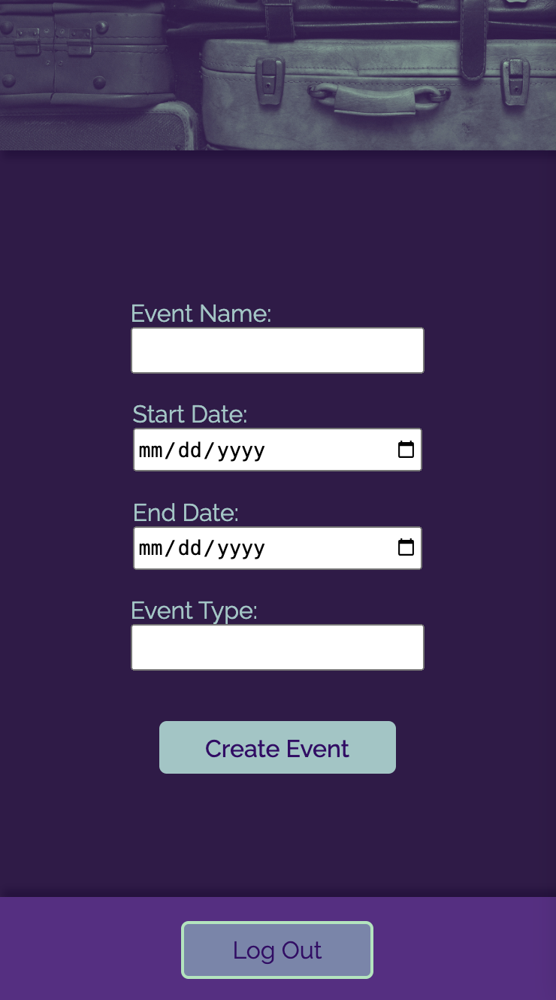
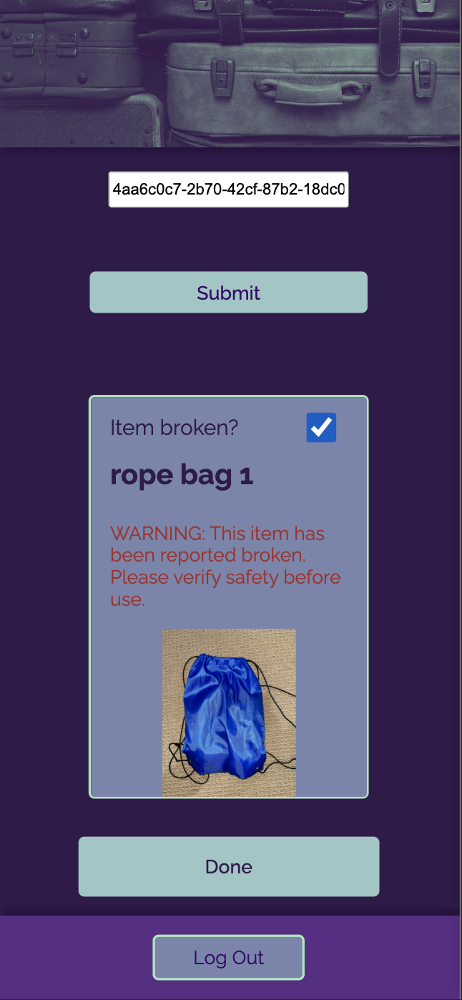
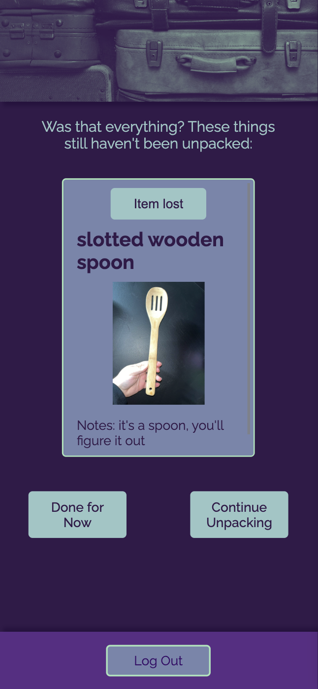

# Pac(ker)Man
Picture this: you and your housemates go to weekend festivals, either individually or as a group. You all share a communal collection of supplies and nice-to-have items. But while sharing is caring, it's easy to misplace things at these events, or for other festival-goers to accidentally (or intentionally) mistake your group's supplies for theirs. Every time you come back home you swear you've lost more items, but you rarely know what went missing until someone says, weeks or months later, "hey, didn't we used to have a ______? Where did that go?"

Enter Pac(ker)Man, a light-weight inventory management system to help keep track of supply locations and states of repair when packing and unpacking. The current iteration allows user to pack and unpack items based on a single, user-generated event to be attended.

## Planning Phase

[Trello board](https://trello.com/b/JUToDreg/p4)

[Entity Relation Diagram](https://lucid.app/lucidchart/fbd37dcd-82f9-475e-b667-ce725b1246d3/edit?invitationId=inv_d9ec91f1-592a-4fd5-b500-4710394e339f&page=0_0#)

[Wireframe](https://drive.google.com/file/d/1vVL9TYqf4JPUaHbqjRhxWpnULh8pIKPJ/view?usp=sharing)

## Current State

## Technologies Used
### Back End:
- PostgresQL
- Django
- Python

### Front End:
- JavaScript
- React
- Node
- Axios
- [Luxon](https://moment.github.io/luxon/#/)

### Hardware
- [Barcode scanner with 1D and 2D capabilities](https://www.amazon.com/Eyoyo-Handheld-Convenience-Supermarket-Warehouse/dp/B088QV215Y/ref=asc_df_B088QV215Y/?tag=hyprod-20&linkCode=df0&hvadid=642123657544&hvpos=&hvnetw=g&hvrand=1966833635196005240&hvpone=&hvptwo=&hvqmt=&hvdev=c&hvdvcmdl=&hvlocint=&hvlocphy=1018587&hvtargid=pla-1220715379093&psc=1&mcid=060598ffe4fa342e9115eced9bd081ec)

## Getting Started
- Install dependencies and seed db - make a superuser and use Django to create the initial items for the database and as many user as are relevant
- Use the uuids generated to create free QR codes
- Print QR codes and attach to items, make name badges for users, however you want to do it
- Get a handy-dandy hand-scanner and set it up - make sure it can use 2D codes
- Run your servers and follow the prompts through event creation, packing, and unpacking!

## Future Improvements:
- Non-fatal bug fixes and ease-of-use improvements
- Ability for individual users to check items out
- Prevent items from being packed more than once
- Add items from the front end